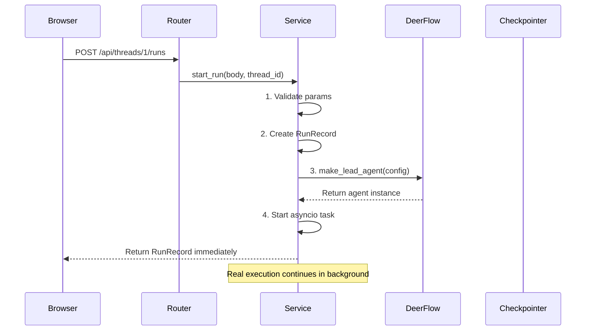
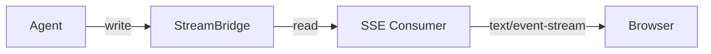

# Gateway 心智模型

> 一针见血，点破迷雾

---

## Gateway 是什么？

**Gateway = HTTP 外壳 + LangGraph 引擎**

外面是 FastAPI（接收 HTTP 请求），里面是 LangGraph Agent（真正干活）。

```
浏览器  →  Nginx  →  Gateway:8001  →  LangGraph Agent
                        ↑
                   FastAPI 层
                   (路由/认证/HTTP 处理)
```

---

## 为什么要分离？

**App 和 Harness 是两个项目，只是打包在一起。**

```
deer-flow/
├── app/           ← Gateway（HTTP 层）
└── packages/
    └── harness/
        └── deerflow/  ← 可独立发布的 Agent 框架
```

- `app/` 依赖 `deerflow/`（导入它）
- `deerflow/` 不能依赖 `app/`（被禁止）
- 这样 `deerflow` 可以单独发布，兼容 LangGraph Studio

---

## 核心概念：Thread 和 Run

### Thread = 对话 + 记忆

就像一个文件夹，装着一次完整对话的所有状态。

```
Thread { id, state: {messages, artifacts, title...} }
```

状态被 LangGraph Checkpointer 持久化，可以随时恢复。

### Run = 一次执行

用户发一条消息 → 触发一个 Run。

```
Thread 1
├── Run 1  →  "帮我写代码"  →  Agent 执行
├── Run 2  →  "改一下"      →  Agent 再次执行
└── Run 3  →  "再改"        →  Agent 又执行
```

---

## Gateway 的三层结构

```
┌─────────────────────────────────────────┐
│           Router（路由层）               │  ← 薄，接收 HTTP，调用 Service
├─────────────────────────────────────────┤
│           Service（业务层）              │  ← 厚，放所有业务逻辑
├─────────────────────────────────────────┤
│           deps.py（依赖层）              │  ← 注入 app.state 里的单例
└─────────────────────────────────────────┘
```

### Router = 薄的外壳

只做：接收请求 → 调用 Service → 返回响应

```python
# threads.py
@router.post("/{thread_id}/runs")
async def create_run(thread_id: str, body: RunCreateRequest, request: Request):
    record = await start_run(body, thread_id, request)  # ← 调用 Service
    return _record_to_response(record)
```

### Service = 厚的内核

放所有业务逻辑：参数校验、状态管理、格式转换。

### deps.py = 依赖注入

类似"全局变量访问器"：

```python
def get_stream_bridge(request):
    return request.app.state.stream_bridge  # 从 app.state 取单例
```

---

## app.state：启动时创建的单例

Gateway 启动时（`lifespan()`），一次性创建这些对象，存在 `app.state`：

```
app.state
├── stream_bridge    → SSE 流式传输
├── checkpointer      → 状态持久化（SQLite/Postgres）
├── store            → LangGraph Store（跨 Thread 数据）
├── run_store        → Run 记录存储
├── feedback_repo    → 用户反馈存储
├── thread_store     → Thread 元数据
└── run_event_store  → Run 事件（用于调试）
```

**为什么放 app.state？** 因为这些对象创建成本高（建连接、占资源），只需要创建一次，全局复用。

---

## Middleware 链：请求过滤器

请求进来后，依次经过：

```
请求 → AuthMiddleware → CSRFMiddleware → CORSMiddleware → Router
         ↓                    ↓                ↓
      认证检查              CSRF 检查         跨域检查
```

### AuthMiddleware = 门卫

fail-closed：没登录就 401。

```python
# 没 cookie → 401
if not request.cookies.get("access_token"):
    return 401
```

### deps.py 如何配合？

AuthMiddleware 把用户信息注入到请求上下文：

```python
request.state.user = user  # ← AuthMiddleware 注入
deerflow.runtime.user_context.set_current_user(user.id)  # ← 注入 contextvar
```

这样后续代码随时能拿到当前用户，不需要层层传递。

---

## Service 如何启动一个 Run？



**关键点：start_run() 立即返回，不阻塞等待 Agent 完成。**

---

## Gateway 如何实现 SSE 流式？

```
1. 创建 StreamBridge（app.state.stream_bridge）
2. Agent 写入 StreamBridge
3. SSE endpoint 从 StreamBridge 读，转成 SSE 格式发给浏览器
```



---

## 为什么 Gateway 能热重载配置？

```python
def get_config():
    return get_app_config()  # 每次调用都重新读文件
```

对比：

| 对象 | 热重载？ | 原因 |
|------|---------|------|
| AppConfig | ✅ | 每次请求重新读 config.yaml |
| StreamBridge | ❌ | 启动时创建，持有连接 |
| Checkpointer | ❌ | 持有数据库连接池 |

**规则：能热重载的必须每次读，不能重载的一次创建。**

---

## 文件对应关系

| 文件 | 行数 | 本质 |
|------|------|------|
| `app.py` | 322 | 启动入口 + 中间件注册 |
| `services.py` | 339 | Run 生命周期、SSE 格式化 |
| `deps.py` | 227 | app.state 访问器 |
| `authz.py` | 231 | 权限装饰器 |
| `routers/threads.py` | 517 | Thread CRUD |
| `routers/thread_runs.py` | 338 | Run 创建 + SSE 流式 |
| `routers/auth.py` | 410 | 登录/注册/Token |

---

## 一句话总结

> **Gateway = FastAPI 外壳 + app.state 单例 + Service 业务逻辑 + Router 薄调用**
>
> 浏览器请求 → AuthMiddleware 认证 → Router 接收 → Service 处理 → DeerFlow Agent 执行 → StreamBridge SSE 推送 → 浏览器

---

## 核心心智模型

### 1. Thread 是对话容器，Run 是执行单元

```
一次对话 = 1 Thread = N Runs
```

### 2. app.state 是启动时创建的"全局单例池"

用 `deps.py` 的 getter 访问，不用层层传递。

### 3. Router 薄，Service 厚

Router 只负责 HTTP 协议，Service 负责业务逻辑。

### 4. Gateway 热重载 config.yaml，DeerFlow 引擎绑定启动时快照

能变的变（AppConfig），不能变的不变（StreamBridge）。

### 5. app → deerflow 是单向依赖

Gateway 可以用 deerflow 的一切，但 deerflow 不能回头导入 app。
