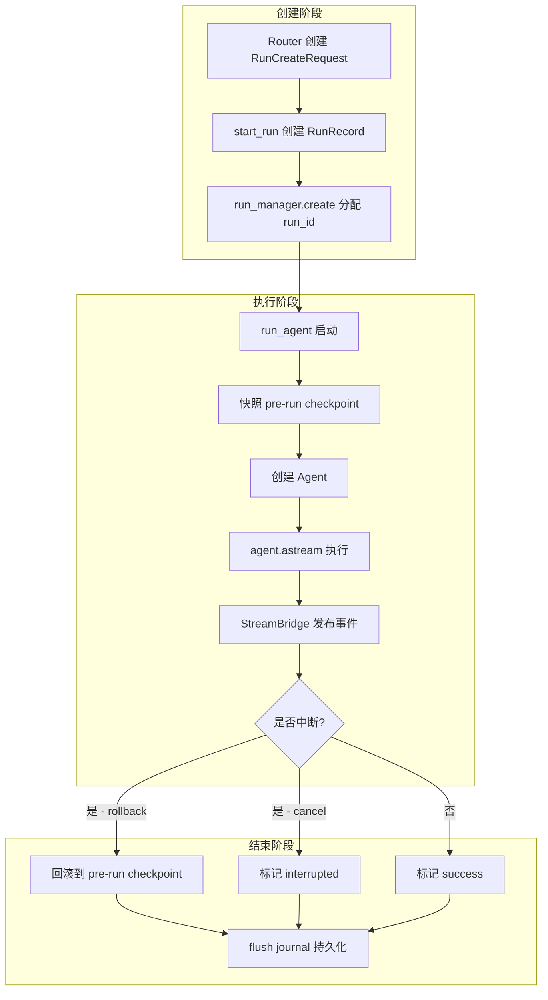
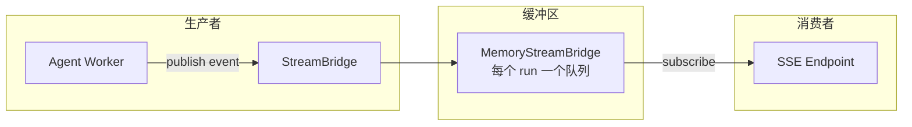
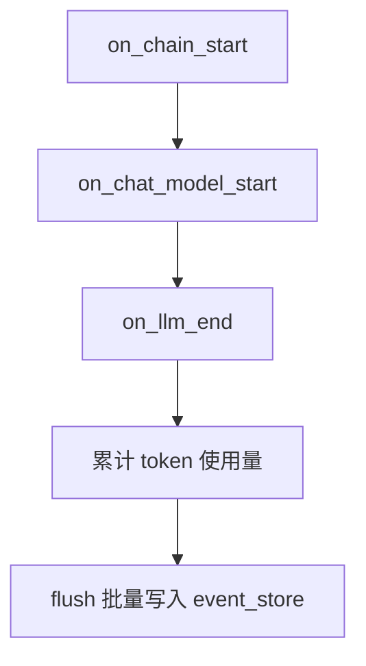

# Runtime 目录心智模型

## 一句话理解

> **Runtime = Agent 执行所需的"操作系统"**

| 对比 | 操作系统 | Runtime |
|------|----------|---------|
| 管理什么 | 进程 | Run（Agent 执行实例） |
| 持久化 | 文件系统 | Checkpointer + Store |
| 通信 | 消息队列/管道 | StreamBridge |
| 调度 | 内核调度器 | RunManager |

---

## 核心组件

```
┌─────────────────────────────────────────────────────────────────┐
│                         Runtime                                 │
├─────────────────────────────────────────────────────────────────┤
│                                                                 │
│  worker.py (509行)  ←── 执行引擎，Agent 的"主函数"                 │
│         │                                                       │
│         ├── 1. 创建 RunRecord                                    │
│         ├── 2. 快照 pre-run checkpoint                          │
│         ├── 3. 创建 agent                                       │
│         ├── 4. 赋值 checkpointer/store                          │
│         ├── 5. 流式执行 agent.astream()                          │
│         ├── 6. 发布事件到 StreamBridge                           │
│         └── 7. 持久化 completion 数据                            │
│                                                                 │
│  manager.py (327行)  ←── Run 生命周期管理                         │
│         ├── RunRecord: 单个 Run 的运行时记录                      │
│         └── 管理 pending/running/success/error 状态              │
│                                                                 │
│  journal.py (437行)  ←── 事件记录（LangChain callbacks）          │
│         ├── 捕获 LLM 调用链                                      │
│         └── 累积 token 使用量                                    │
│                                                                 │
├─────────────────────────────────────────────────────────────────┤
│  checkpointer/   ←── 状态快照（对话历史持久化）                     │
│  store/         ←── 跨线程共享存储                                │
│  stream_bridge/ ←── SSE 流式传输                                 │
│  events/store/  ←── Run 事件存储                                 │
│  runs/store/    ←── Run 元数据存储                               │
└─────────────────────────────────────────────────────────────────┘
```

---

## Run 生命周期流程



---

## StreamBridge 机制



**核心逻辑**：
- `publish()`: 生产者把事件写入队列
- `subscribe()`: 消费者从队列读取，支持 `Last-Event-ID` 断线重连
- `publish_end()`: 生产者通知结束
- `HEARTBEAT_SENTINEL`: 超过 15s 无消息则发送心跳

---

## RunContext：依赖注入容器

```python
@dataclass(frozen=True)
class RunContext:
    """Agent 执行所需的基础设施依赖。"""
    checkpointer: Any      # 状态快照
    store: Any | None       # 跨线程存储
    event_store: Any | None # 事件存储
    run_events_config: Any | None
    thread_store: Any | None
    app_config: AppConfig | None
```

**设计思想**：
- 把所有基础设施依赖打包成一个对象
- 避免 `run_agent()` 参数列表越来越长
- 类似于操作系统的进程控制块 (PCB)

---

## Checkpointer vs Store

| 概念 | 作用域 | 用途 |
|------|--------|------|
| **Checkpointer** | 线程级别 | 保存对话历史快照，支持断线重连 |
| **Store** | 全局级别 | 跨线程共享数据，如用户信息、记忆 |

---

## journal.py：LLM 调用的"监控录像"



**为什么不实现 `on_llm_new_token`**？
- 只在 `on_llm_end` 时记录完整响应
- 流式 token 会被累积后一次性写入

---

## 文件速查表

| 文件 | 行数 | 职责 |
|------|------|------|
| `worker.py` | 509 | Agent 执行引擎 |
| `journal.py` | 437 | LLM 事件捕获 |
| `manager.py` | 327 | Run 状态管理 |
| `db.py` | 282 | 事件 DB 存储 |
| `jsonl.py` | 160 | 事件 JSONL 存储 |
| `user_context.py` | 148 | 用户上下文 ContextVar |
| `stream_bridge/base.py` | 95 | 流式协议抽象 |
| `stream_bridge/memory.py` | 107 | 内存流式实现 |
| `runs/store/base.py` | 90 | Run 存储接口 |
| `events/store/base.py` | 90 | 事件存储接口 |

---

## 面试重点

1. **StreamBridge 解耦了什么？**
   - 生产者（Agent Worker）和消费者（SSE Endpoint）解耦
   - 支持多消费者订阅同一 run_id

2. **为什么需要 pre-run checkpoint 快照？**
   - 支持 rollback 机制
   - 用户中断时回滚到执行前状态

3. **journal.py 的 token 累计怎么工作的？**
   - 每个 LLM call 累加 input/output tokens
   - Run 结束时一次性写入 store

4. **RunContext vs 直接传参数？**
   - 避免参数列表膨胀
   - 提供"基础设施依赖"的逻辑分组
